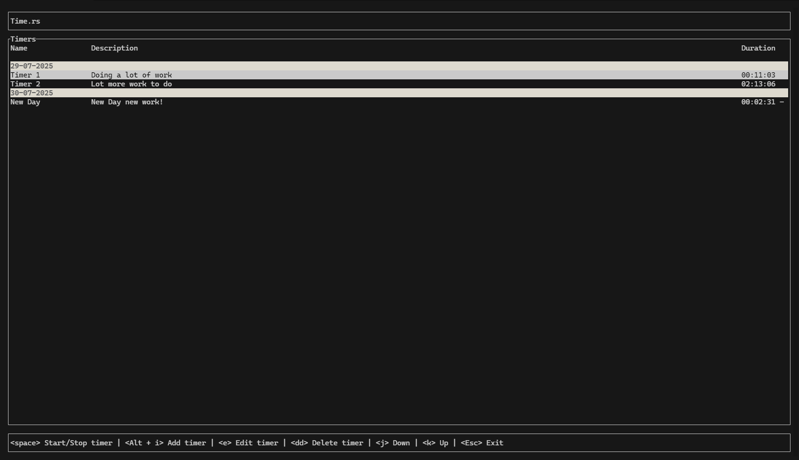

# ⏱️ time-rs

[](https://www.rust-lang.org/)
[](https://opensource.org/licenses/MIT)
[](#)

A fast, lightweight, and intuitive **Terminal User Interface (TUI)** timer application written in Rust. No GUI, no bloat, just a timer app! 



## ✨ Features

- **Fast, leightweight, no bloat** - It is just a timer app!
- **Beautiful TUI** - Clean terminal interface using Ratatui
- **Persistent Storage** - SQLite database stores all your timers
- **Start/Stop/Resume** - Full timer control with real-time updates
- **Timer Management** - Create, edit, delete, and organize timers
- **Date Grouping** - Timers automatically grouped by creation date
- **Keyboard Navigation** - Efficient vim-like keybindings
- **Cross-platform** - Works on Windows, macOS, and Linux

## 🚀 Quick Start

### Prerequisites

- [Rust](https://rustup.rs/) 1.70 or higher
- A terminal that supports Unicode and colors

### Installation

#### Using Cargo (Recommended)

```bash
cargo install time-rs
```

#### From Source 

```bash
# Clone the repository
git clone https://github.com/d9r-dev/time-rs.git
cd time-rs

# Build and install
cargo install --path .

# Or run directly
cargo run
```


#### Pre-built Binaries

Download the latest release from the [releases page](https://github.com/d9r-dev/time-rs/releases).

## 🎮 Usage

### Starting the Application

```bash
time-rs
```

### Main Interface

The main screen displays all your timers in a table format, grouped by date:

```
┌─ Timers ─────────────────────────────────────────────────────────────┐
│ 2025-01-28                                                           │
│ Work Session          Deep focus work        01:23:45                │
│ Break Timer           Short break            00:05:00                │
│                                                                      │
│ 2025-01-27                                                           │
│ Meeting Prep          Prepare presentation   00:45:30                │
└──────────────────────────────────────────────────────────────────────┘
```

### Keybindings

#### Main Screen

| Key | Action |
|-----|--------|
| `j` / `↓` | Move down |
| `k` / `↑` | Move up |
| `Space` | Start/Stop selected timer |
| `Alt+i` | Add new timer |
| `e` | Edit selected timer |
| `dd` | Delete selected timer (press `d` twice quickly) |
| `Esc` / `Ctrl+C` | Exit application |

#### Add/Edit Timer Dialog

| Key | Action |
|-----|--------|
| `Enter` | Confirm current field / Save timer |
| `Tab` | Switch between fields |
| `Backspace` | Delete character |
| `Esc` | Cancel and return to main screen |

#### Exit Confirmation

| Key | Action |
|-----|--------|
| `y` / `Enter` (on Yes) | Confirm exit |
| `n` / `q` / `Enter` (on No) | Cancel exit |
| `Tab` | Toggle between Yes/No |

### Timer Operations

#### Creating a Timer
1. Press `Alt+i` to open the "Add Timer" dialog
2. Enter a name for your timer
3. Press `Enter` to move to the description field
4. Enter a description (optional)
5. Press `Enter` to create the timer

#### Starting/Stopping Timers
- Navigate to a timer using `j`/`k`
- Press `Space` to start or stop the timer
- Running timers show a spinning indicator and update in real-time

#### Editing Timers
1. Select a timer with `j`/`k`
2. Press `e` to edit
3. Modify the name and/or description
4. Press `Enter` to save changes

#### Deleting Timers
1. Select a timer with `j`/`k`
2. Press `d` twice quickly (within 500ms) to delete
3. The timer will be permanently removed

## 🗂️ Data Storage

Timers are automatically saved to a SQLite database located at:

- **Windows**: `%APPDATA%\timers\timers.db`
- **macOS**: `~/Library/Application Support/timers/timers.db`
- **Linux**: `~/.local/share/timers/timers.db`

The database stores:
- Timer name and description
- Creation date and time
- Total elapsed duration
- Current running state

## 🏗️ Architecture

The application follows a modular architecture:

```
src/
├── main.rs          # Entry point and event loop
├── lib.rs           # Module exports
└── lib/
    ├── app.rs       # Application state and logic
    ├── db.rs        # SQLite database operations
    ├── ui.rs        # TUI rendering and layout
    └── throbber.rs  # Loading animation component
```

### Key Dependencies

- **[ratatui](https://github.com/ratatui-org/ratatui)** - Terminal UI framework
- **[crossterm](https://github.com/crossterm-rs/crossterm)** - Cross-platform terminal manipulation
- **[rusqlite](https://github.com/rusqlite/rusqlite)** - SQLite database bindings
- **[chrono](https://github.com/chronotope/chrono)** - Date and time handling
- **[dirs](https://github.com/dirs-dev/dirs-rs)** - Platform-specific directories

## 🧪 Testing

Run the test suite:

```bash
# Run unit tests
cargo test

# Run integration tests
cargo test --test integration

# Run with coverage
cargo test --all-features
```

## 🤝 Contributing

Contributions are welcome! Please feel free to submit a Pull Request.

### Development Setup

1. Fork the repository
2. Clone your fork:
   ```bash
   git clone https://github.com/d9r-dev/time-rs.git
   cd time-rs
   ```
3. Create a feature branch:
   ```bash
   git checkout -b feature/amazing-feature
   ```
4. Make your changes and add tests
5. Run the test suite:
   ```bash
   cargo test
   cargo clippy
   cargo fmt
   ```
6. Commit your changes:
   ```bash
   git commit -m "Add amazing feature"
   ```
7. Push to your fork and submit a pull request

### Code Style

- Follow Rust's official style guidelines
- Run `cargo fmt` before committing
- Ensure `cargo clippy` passes without warnings
- Add tests for new functionality
- Update documentation as needed

### Reporting Issues

Please use the [GitHub issue tracker](https://github.com/d9r-dev/time-rs/issues) to report bugs or request features.

When reporting bugs, please include:
- Your operating system and version
- Rust version (`rustc --version`)
- Steps to reproduce the issue
- Expected vs actual behavior

## 📋 Roadmap

- [ ] Export timers to CSV/JSON ?

## 📄 License

This project is licensed under the MIT License - see the [LICENSE](LICENSE) file for details.

## 🙏 Acknowledgments

- [Ratatui](https://github.com/ratatui-org/ratatui) team for the excellent TUI framework
- [Crossterm](https://github.com/crossterm-rs/crossterm) for cross-platform terminal support
- The Rust community for their amazing ecosystem

## 📞 Support

If you find this project helpful, please consider:

- ⭐ Starring the repository
- 🐛 Reporting bugs and issues
- 💡 Suggesting new features
- 🤝 Contributing code or documentation

---

**Happy timing!**
